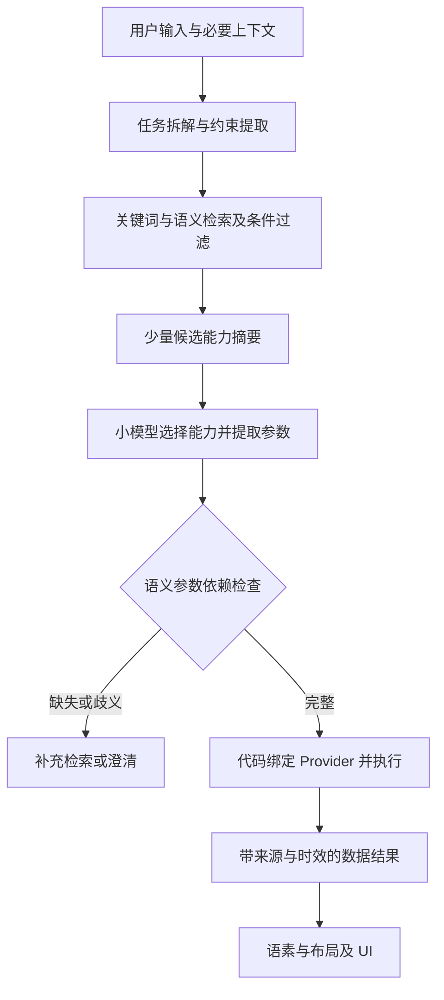

# API 能力登记与意图理解演进方案

> 整理日期：2026-09-09。
> 状态：设计建议，尚未实现；不代表已验证的小模型准确率或性能承诺。
> 代码基线：`claude` 分支 `cdc1d11`，主线为 `genui_v2/`。

## 1. 目标与结论

面向大量场景和 API，解决两个问题：如何在有限上下文中选择正确能力，以及如何充分理解长文本、短文本和复杂请求。

核心方案：

1. 登记可复用的业务能力，而非把全部 API 文档放进模型上下文。
2. 检索器搜索完整目录，模型只读取少量候选摘要；代码负责具体 API 映射、校验与执行。
3. 在语素层之前增加紧凑的任务意图层，保留实体、参数、否定、条件和依赖。
4. 事实信息来自真实 API、系统 SDK 或有来源的缓存；模型不能补造业务数据。
5. 小模型处理边界明确的任务，复杂请求通过分解、校验、澄清或更强模型兜底。

API 检索与意图理解应分别评测：候选未召回、模型选错、参数丢失和执行失败不是同一类问题。

## 2. 当前 v2 的基础与缺口

现有链路已实现语素草稿、能力绑定、组件推导、信息预算、业务变体、模板/自由布局以及 HTML、A2UI、DSL 输出，可以继续复用。

| 当前实现 | 局限 | 建议演进 |
|---|---|---|
| `capability.py` 中的 Python 注册表 | 业务描述、样例数据与绑定混在一起 | 独立能力清单、执行适配器和数据契约 |
| `router.py` 单领域路由 | 跨域请求容易被过早压缩 | 多候选检索，领域仅辅助排序 |
| 别名首个命中、token 重叠阈值为 1 | 有顺序依赖及近似能力误绑定风险 | 重排、歧义判定、参数兼容校验 |
| 草稿 `{t, m:[{l,q,f,r}]}` | 适合展示语义，难以完整保存条件和任务依赖 | 增加紧凑任务意图层，再派生语素 |
| 注册表样例值用于展示 | 尚未形成真实数据获取与刷新闭环 | 接入 API/SDK，返回来源、时效与状态 |

注册表 EXACT 命中只证明模型给出的键存在，不能证明用户意图理解正确。现有“常规一次主模型调用”可作为简单请求的快速路径，不应成为复杂请求必须遵守的约束。

## 3. 能力登记：语义、执行与数据分层

### 3.1 登记单位

区分三种对象：

- **业务能力**：查询指定地点和时间范围的降雨概率。
- **执行接口**：某供应商的逐小时天气预报 API。
- **展示字段**：明早出门时的降雨概率。

三者不必一一对应。一次 API 调用可提供多个字段，同一能力也可由多个 Provider 实现。代码负责映射和请求合并，供应商变更不应影响意图协议与 UI。

场景使用多标签表达，例如 `weather/travel/outdoor`，不建立只能选择一个分支的巨大场景分类树。

### 3.2 三层契约

| 层 | 内容 | 消费方 |
|---|---|---|
| 能力摘要 | 能做什么、适用与不适用情况、对象、操作、输入输出概要 | 检索器、小模型 |
| 执行契约 | 参数 Schema、API/SDK 映射、权限、错误、超时、版本 | 校验器、执行器 |
| 数据契约 | 字段含义、单位、时间范围、来源、刷新、缓存规则 | 数据层、UI |

以下为建议格式，引用文件仅为示意，不是仓库现有资源：

```yaml
capabilityId: weather.precipitation.query
version: 1
summary: 查询指定地点和时间范围内的降水概率
tags: [weather, travel, outdoor]
operation: READ
useWhen:
  - 用户询问是否下雨、降水概率
  - 用户询问是否需要带伞
notFor:
  - 查询室内湿度
  - 创建下雨提醒
inputs:
  location:
    type: GeoLocation
    required: true
    allowedSources: [explicit, conversation, authorized_location]
  timeRange:
    type: TimeRange
    required: true
outputs:
  schemaRef: schemas/precipitation-result.json
execution:
  adapter: weather_provider
  operationId: getHourlyForecast
  mappingRef: mappings/precipitation.json
dataPolicy:
  freshnessPolicyRef: policies/weather.json
  supportsSubscription: false
```

执行信息可从 OpenAPI 导入，业务边界、典型说法和易混淆反例需补充维护。读取状态和改变状态应登记为可区分的操作；显示一个控制按钮，不等于用户已经要求立即执行动作。

### 3.3 目录治理

- 每项能力有稳定 ID、版本、负责人、输入输出契约、正例与反例。
- 安装、升级、卸载 Provider 时校验清单并增量更新索引，处理重复 ID 和不兼容版本。
- 凭据保留在执行环境，不进入模型上下文。
- 多 Provider 的选择优先遵循用户指定、系统默认、覆盖范围和可用性。
- 缓存与请求合并必须区分用户、实体、参数和权限范围，不能仅按能力 ID 复用。

## 4. 按需发现与执行流程



### 4.1 召回与选择

1. 组合关键词、别名与语义向量检索，按设备支持、Provider 安装状态、地域等过滤。
2. 领域标签作为检索加分项，避免单次错误路由永久排除正确能力。
3. 可先召回 20～40 项，再重排到每个子任务 3～8 项。这仅是实验起点，最终由召回率、上下文预算和端侧延迟决定。
4. 模型选择候选 ID、抽取参数并报告缺失项；不生成任意 URL、鉴权信息或调用代码。
5. 代码检查候选合法性、参数类型/范围、对象身份、权限与前置条件，之后调用适配器。

全库检索不等于全库进入上下文。需要检索的是完整索引，需要加载的是少量候选摘要；选中后再按需加载详细契约。

### 4.2 失败与歧义出口

- 未找到候选：有界扩大检索，仍未找到则明确不支持。
- 多个候选无法区分：保留歧义并获取缺失信息，不强行取最高分。
- 能力需要授权：可保留为待授权候选，真正执行前由宿主检查权限。
- 缺少参数：从允许的上下文来源补全，否则澄清。
- 只有查询能力、没有条件订阅能力：不能把“下雨才提醒”偷偷降级为普通定时提醒。

## 5. 任务意图与展示语素分离

例如“明早八点提醒我带伞，只有上海会下雨才提醒，不要展示湿度”，需要表达地点、时间、条件、任务依赖和展示排除项，仅靠 `l/q/f/r` 不够。

建议增加稀疏的任务意图结构：

| 字段 | 作用 |
|---|---|
| `tasks` | 一个或多个用户任务 |
| `operation` | 查询、设置、创建、订阅等 |
| `target` | 对象或实体引用 |
| `arguments` | 时间、地点、数值等参数 |
| `constraints` | 否定、范围、排序、限制 |
| `dependencies` | 先后与条件关系 |
| `presentation` | 尺寸、强调内容、展示排除项 |
| `unresolved` | 缺失、歧义、不支持事项 |

简单请求只输出必要字段，复杂请求才展开，不要求每次填写大表。可参考 v1 意图结构，但不直接恢复全部重协议。

语素由任务和结果派生，也可以先构建等待数据的 UI 骨架；任务意图必须独立保留。卡片预算可以减少展示信息，不能删除用户要求执行的任务。多任务中无法完成的部分应显式报告。

## 6. 长文本与短文本处理

### 6.1 长文本：保留任务证据

不先生成普通摘要再识别意图，避免丢失“不要”“除了”“如果”“改成”等执行条件。

处理顺序：

1. 区分用户指令、背景与引用材料。
2. 按任务或语义段提取实体、操作、参数、条件、否定。
3. 为关键字段保留原文位置或简短证据。
4. 合并指代与重复项，处理明确自我修正，保留未解决冲突。
5. 检查显式要求是否全部进入任务计划。

示例：“下周去杭州出差，周二上午见客户，别安排九点前的提醒。之前说的上海不用管了，只看杭州天气和高铁信息。”

必须保留杭州、时间、天气与高铁两类需求、提醒限制，以及上海被撤销；不能仅压缩成“需要出行助手”。“见客户”这类背景也不应自动变成创建日程的指令。

只对较长输入分段，合并时检查跨段实体、时间和否定。短输入走直接解析路径，避免无必要的多次调用。

### 6.2 短文本：补全有依据的槽位

“调暗一点”需要确定对象、相对调整策略，必要时读取当前值。补全来源按以下顺序考虑：

```text
本句明确内容 → 当前对话 → 当前交互对象
→ 已授权环境信息 → 已声明产品默认
```

每个补全值记录来源。正在操作台灯卡片时可以引用该台灯；无上下文且屏幕、台灯都合理时，应澄清对象。

区分两类扩充：

- **检索扩充**：增加同义词帮助召回，不改变用户请求。
- **意图补全**：增加影响执行的参数，必须有证据或明确默认。

“我累了”可形成候选理解，但不能凭此自动执行关灯、调空调、播放音乐。更大模型也无法可靠补出用户未提供且环境未知的信息。

## 7. 真实数据闭环

建议数据层统一返回：能力 ID、Provider、实际参数、业务数据、观测时间、获取时间、有效期及结果状态。状态需区分成功、无数据、权限不足、过期缓存和请求失败。

- 样例值仅在演示模式使用，生产失败不能回退为看似真实的样例。
- 使用旧缓存时明确标注时效；不得把获取时间冒充数据观测时间。
- 聚合或计算结果保留输入数据来源和计算规则。
- 创作文案与事实数据分开标识；模型生成内容不能冒充 API 返回事实。
- 刷新、取消、超时、重试和写操作幂等由执行层管理。
- 卡片展示可以先出骨架，再按真实结果更新，不必等待所有查询完成。

## 8. 小模型的职责和升级路径

| 请求类型 | 建议路径 |
|---|---|
| 简短、明确、常见单任务 | 检索 + 小模型直接解析 |
| 少量槽位或两个明确任务 | 小模型 + 确定性检查 |
| 长文本、跨域、多条件、多次修正 | 分解抽取与合并校验，必要时升级 |
| 对象缺失或指代歧义 | 补充上下文或澄清 |
| 能力库不支持 | 明确不支持 |
| 开放式规划、复杂隐含需求 | 更强模型兜底或限制产品范围 |

不能预先保证 Qwen2.5 3B 满足开放场景需求。全端侧可组合小模型、本地检索/重排、规则解析和澄清，并接受一定拒答率。是否接入云端兜底取决于产品的隐私、离线和成本约束。

大模型也可只用于离线挖掘同义词、生成候选训练数据和蒸馏；生成数据需要审核，不能与冻结测试集混用。

按错误定位改进：未召回改检索；候选内选错改描述、重排或训练；参数/条件遗漏改协议与抽取；本身缺信息则澄清；接口失败改执行层。不要把全部问题都归结为模型尺寸。

## 9. 评测设计

冻结集应覆盖短句、长文本、否定、自我修正、指代、跨域、多任务、条件依赖、领域外请求，以及“领域内但能力不支持”的请求。避免开发集成绩被当作泛化能力。

| 指标 | 需要回答的问题 |
|---|---|
| 候选 Recall@K | 正确能力是否进入候选？ |
| 能力选择准确率 | 是否选对，是否强行接受不支持请求？ |
| 槽位与约束完整率 | 对象、时间、数值、否定和条件是否保留？ |
| 任务覆盖率 | 是否漏任务或凭空增加任务？ |
| 澄清质量 | 该问时是否询问，不该问时是否打断？ |
| 端到端执行正确率 | API 参数和结果是否符合原始请求？ |
| 数据真实性与时效 | 是否有来源，错误和过期是否被正确呈现？ |
| 端侧成本 | P50/P95 延迟、内存、调用次数是多少？ |

阈值应在独立验证集上校准，再在冻结测试集报告结果。不要直接使用模型自报置信度决定执行。联合观察自动接受率与错误率，并按读取、写入等操作类型分层统计。

## 10. 分阶段落地

1. **真实数据最小闭环**：先接天气、日程、设备状态三个领域，统一数据来源、时效和失败状态，隔离演示样例。验收重点是事实可追溯、失败不造数。
2. **能力目录工程化**：清单与适配器分离，补参数 Schema、边界、正反例和版本校验。
3. **多候选检索**：替换单领域硬路由与首个别名绑定，增加重排、歧义和有界扩大检索，测量 Recall@K。
4. **紧凑任务意图层**：保存实体、约束和依赖，再接回现有语素与布局，验证展示裁剪不丢任务。
5. **冻结评测与模型决策**：比较当前小模型、微调路线和更强模型，按准确率、澄清率与延迟决定产品边界。

各阶段均保留简单请求快速路径。优先补齐意图和数据链路，不重写已经可复用的 UI 引擎。

## 11. 参考依据

以下资料支持接口契约、按需工具发现与范围外意图评测的设计方向；不构成本项目或 Qwen2.5 3B 的性能证明。

- [OpenAPI Specification 3.0.3](https://spec.openapis.org/oas/v3.0.3)：操作、参数、响应与安全契约。
- [Anthropic：Introducing advanced tool use](https://www.anthropic.com/engineering/advanced-tool-use)：按需发现工具，避免预加载完整工具定义。
- [Are Pretrained Transformers Robust in Intent Classification?](https://arxiv.org/abs/2106.04564)：领域内但范围外的请求是需要单独评测的风险。
- 项目上下文：[项目收敛总结](项目收敛总结.md)、[V2 全端侧方案设计](V2-全端侧方案设计.md)。
