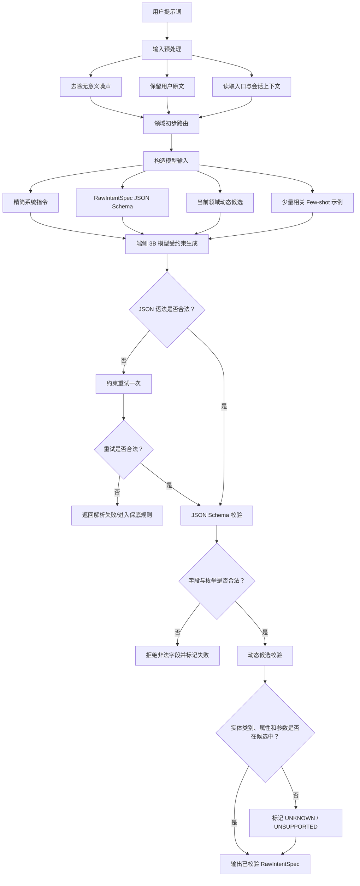
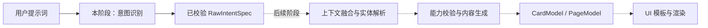

# 端侧模型意图输出协议

> 适用范围：从用户提示词进入系统，到端侧小模型输出结构化意图并完成语法、Schema 基础校验为止。本文不包含实体解析、系统能力调用、内容生成、模板选择和 UI 渲染。

## 1. 设计结论

端侧模型输出应采用精简的 `RawIntentSpec`，只表达用户任务语义，不直接输出 `Button`、`Slider`、卡片模板、DSL、HTML 或系统动作 ID。

核心范式为：

```text
用户总体意图
└── 一个或多个任务
    ├── 对象：对谁或什么操作
    ├──行为：要做什么
    ├── 属性：对象的哪个方面
    ├── 参数：目标值、相对变化、内容等
    ├── 上下文：时间、地点、事件、活动等
    └── 依赖：任务之间的先后或条件关系

+ 用户明确提出的展示要求
+ 缺失信息和解析状态
```

约束原则：

1. 参与程序分支的字段使用固定枚举。
2. 领域实体、属性等使用运行时动态候选 ID，不建立无限扩张的全局枚举。
3. 用户名称、搜索词、提醒内容等保留为开放字符串。
4. 模型不生成设备 ID、系统 Action ID、运行时数据和最终 UI 组件。
5. 模型不确定时输出 `UNKNOWN` 或缺失项，不得编造。

## 2. 命名规范

| 对象 | 规范 | 示例 |
|---|---|---|
| TypeScript 类型、接口 | 大驼峰 | `RawIntentSpec`、`IntentTask` |
| JSON 字段、参数、变量 | 小驼峰 | `intentType`、`entityMention` |
| 函数 | 小驼峰 | `validateIntentSpec()` |
| 枚举类型 | 大驼峰 | `IntentType` |
| 枚举值 | 全大写加下划线 | `NEEDS_CLARIFICATION` |
| 动态注册表 ID | 小写蛇形 | `brightness`、`air_conditioner` |

## 3. 推荐的模型输出 JSON

```json
{
  "version": "1.0",
  "intentType": "CREATE",
  "domain": "CONTENT",
  "goalType": "OBTAIN_EMOTIONAL_SUPPORT",
  "tasks": [
    {
      "taskId": "task_1",
      "entity": {
        "entityType": "CONTENT",
        "entityCategoryKey": "encouragement_message",
        "entityMention": null,
        "referenceType": "UNSPECIFIED"
      },
      "operation": {
        "operationType": "CREATE",
        "propertyKey": "content"
      },
      "parameters": [
        {
          "parameterKey": "recipient",
          "value": "SELF",
          "valueType": "ENUM",
          "expressionType": "EXACT",
          "direction": null,
          "degree": null,
          "unit": null,
          "valueSource": "INFERRED"
        },
        {
          "parameterKey": "topic",
          "value": "exam",
          "valueType": "STRING",
          "expressionType": "EXACT",
          "direction": null,
          "degree": null,
          "unit": null,
          "valueSource": "USER"
        },
        {
          "parameterKey": "tone",
          "value": "ENCOURAGING",
          "valueType": "ENUM",
          "expressionType": "EXACT",
          "direction": null,
          "degree": null,
          "unit": null,
          "valueSource": "INFERRED"
        }
      ],
      "contexts": [
        {
          "contextType": "EVENT",
          "value": "exam",
          "temporalType": "IMMINENT",
          "valueSource": "USER"
        }
      ],
      "dependsOn": []
    }
  ],
  "presentation": {
    "surfaceType": "AUTO",
    "interactionMode": "VIEW",
    "density": "AUTO",
    "requestedSize": null
  },
  "resolution": {
    "status": "RESOLVED",
    "certainty": "HIGH",
    "missingFields": []
  }
}
```

## 4. TypeScript 类型定义

```typescript
interface RawIntentSpec {
  version: "1.0";
  intentType: IntentType;
  domain: DomainType;
  goalType: GoalType;
  tasks: IntentTask[];
  presentation: PresentationRequest;
  resolution: ResolutionResult;
}

interface IntentTask {
  taskId: string;
  entity: EntityReference;
  operation: OperationSpec;
  parameters: IntentParameter[];
  contexts: IntentContext[];
  dependsOn: string[];
}

interface EntityReference {
  entityType: EntityType;

  // 从当前领域注册表或运行时候选集中选择，例如 light、weather、message。
  // 无匹配项时填 null，并通过 entityType=OTHER/UNKNOWN 表达结果。
  entityCategoryKey: string | null;

  // 用户原文中的对象名称，例如“床头那个灯”；不得改写为虚构名称。
  entityMention: string | null;
  referenceType: ReferenceType;
}

interface OperationSpec {
  operationType: OperationType;

  // 从当前领域允许的属性列表中选择，例如 brightness、temperature、content。
  propertyKey: string | null;
}

interface IntentParameter {
  // 从当前领域参数注册表中选择，例如 target_value、recipient、tone。
  parameterKey: string;
  value: string | number | boolean | null;
  valueType: ValueType;
  expressionType: ExpressionType;
  direction: DirectionType | null;
  degree: DegreeType | null;
  unit: string | null;
  valueSource: ValueSource;
}

interface IntentContext {
  contextType: ContextType;
  value: string | number | boolean | null;
  temporalType: TemporalType;
  valueSource: ValueSource;
}

interface PresentationRequest {
  surfaceType: SurfaceType;
  interactionMode: InteractionMode;
  density: DensityType;

  // 仅保留用户明确说出的尺寸，例如“2x2”；否则为 null。
  requestedSize: string | null;
}

interface ResolutionResult {
  status: ResolutionStatus;
  certainty: CertaintyLevel;
  missingFields: MissingFieldType[];
}
```

## 5. 固定枚举定义

### 5.1 IntentType：总体意图类型

```typescript
enum IntentType {
  QUERY = "QUERY",
  CONTROL = "CONTROL",
  CREATE = "CREATE",
  EDIT = "EDIT",
  DELETE = "DELETE",
  NAVIGATE = "NAVIGATE",
  COMMUNICATE = "COMMUNICATE",
  RECOMMEND = "RECOMMEND",
  MONITOR = "MONITOR",
  AUTOMATE = "AUTOMATE",
  UNKNOWN = "UNKNOWN"
}
```

| 枚举值 | 含义 |
|---|---|
| `QUERY` | 查询或查看已有信息，例如天气、电量、日程。 |
| `CONTROL` | 改变设备、应用或系统状态。 |
| `CREATE` | 创建内容、任务、提醒、日程等新对象。 |
| `EDIT` | 修改已有内容或对象。 |
| `DELETE` | 删除已有内容或对象。 |
| `NAVIGATE` | 打开应用、页面、设置项或资源。 |
| `COMMUNICATE` | 拨号、发消息、发送邮件、分享等。 |
| `RECOMMEND` | 请求推荐、筛选或决策辅助。 |
| `MONITOR` | 持续观察某状态并展示变化。 |
| `AUTOMATE` | 创建条件、触发器和动作组成的自动化。 |
| `UNKNOWN` | 无法确定总体意图。 |

### 5.2 DomainType：业务领域

```typescript
enum DomainType {
  SMART_HOME = "SMART_HOME",
  DEVICE = "DEVICE",
  WEATHER = "WEATHER",
  MEDIA = "MEDIA",
  CALENDAR = "CALENDAR",
  TASK = "TASK",
  HEALTH = "HEALTH",
  FITNESS = "FITNESS",
  COMMUNICATION = "COMMUNICATION",
  CONTENT = "CONTENT",
  SEARCH = "SEARCH",
  TRAVEL = "TRAVEL",
  SHOPPING = "SHOPPING",
  SYSTEM = "SYSTEM",
  OTHER = "OTHER",
  UNKNOWN = "UNKNOWN"
}
```

| 枚举值 | 含义 |
|---|---|
| `SMART_HOME` | 灯、空调、窗帘等智能家居。 |
| `DEVICE` | 手机、电池、耳机、网络等设备状态。 |
| `WEATHER` | 当前天气、预报、空气质量等。 |
| `MEDIA` | 音乐、视频、播客、图片等媒体。 |
| `CALENDAR` | 日期、日程、会议等。 |
| `TASK` | 待办、提醒、计时和任务进度。 |
| `HEALTH` | 心率、睡眠、用药等健康信息。 |
| `FITNESS` | 步数、运动、训练和目标进度。 |
| `COMMUNICATION` | 联系人、电话、消息、邮件和分享。 |
| `CONTENT` | 文案、祝福、摘要、创作等内容生成。 |
| `SEARCH` | 通用搜索和信息检索。 |
| `TRAVEL` | 路线、交通、酒店和行程。 |
| `SHOPPING` | 商品、比价、购物清单等。 |
| `SYSTEM` | 应用、设置、权限和系统功能。 |
| `OTHER` | 已识别但不属于已有领域。 |
| `UNKNOWN` | 无法识别领域。 |

### 5.3 GoalType：用户最终目标

```typescript
enum GoalType {
  OBTAIN_INFORMATION = "OBTAIN_INFORMATION",
  CHANGE_STATE = "CHANGE_STATE",
  COMPLETE_TASK = "COMPLETE_TASK",
  CREATE_CONTENT = "CREATE_CONTENT",
  MAKE_DECISION = "MAKE_DECISION",
  TRACK_PROGRESS = "TRACK_PROGRESS",
  OBTAIN_EMOTIONAL_SUPPORT = "OBTAIN_EMOTIONAL_SUPPORT",
  REDUCE_EFFORT = "REDUCE_EFFORT",
  OTHER = "OTHER",
  UNKNOWN = "UNKNOWN"
}
```

| 枚举值 | 含义 |
|---|---|
| `OBTAIN_INFORMATION` | 获得某项事实或状态。 |
| `CHANGE_STATE` | 改变设备、应用或对象状态。 |
| `COMPLETE_TASK` | 完成某个事务性目标。 |
| `CREATE_CONTENT` | 产生文案、图片描述、摘要等内容。 |
| `MAKE_DECISION` | 比较、筛选、推荐，辅助用户决策。 |
| `TRACK_PROGRESS` | 观察目标或任务进展。 |
| `OBTAIN_EMOTIONAL_SUPPORT` | 获得鼓励、安慰、陪伴等情感支持。 |
| `REDUCE_EFFORT` | 通过快捷入口或自动化减少操作成本。 |
| `OTHER` | 目标明确但不属于已有类型。 |
| `UNKNOWN` | 无法确定目标。 |

### 5.4 EntityType：通用对象大类

```typescript
enum EntityType {
  DEVICE = "DEVICE",
  INFORMATION = "INFORMATION",
  CONTENT = "CONTENT",
  PERSON = "PERSON",
  EVENT = "EVENT",
  TASK = "TASK",
  MEDIA = "MEDIA",
  LOCATION = "LOCATION",
  SERVICE = "SERVICE",
  SETTING = "SETTING",
  MESSAGE = "MESSAGE",
  REMINDER = "REMINDER",
  AUTOMATION = "AUTOMATION",
  OTHER = "OTHER",
  UNKNOWN = "UNKNOWN"
}
```

| 枚举值 | 含义 |
|---|---|
| `DEVICE` | 灯、空调、手机、耳机等设备。 |
| `INFORMATION` | 天气、电量、状态、统计值等信息。 |
| `CONTENT` | 文案、摘要、祝福、图片描述等内容。 |
| `PERSON` | 用户、联系人、群组成员等。 |
| `EVENT` | 考试、会议、节日、出行等事件。 |
| `TASK` | 待办事项、目标或操作任务。 |
| `MEDIA` | 歌曲、视频、播客、相册等。 |
| `LOCATION` | 地点、房间、目的地等。 |
| `SERVICE` | 搜索、打车、外卖等服务。 |
| `SETTING` | 系统或应用设置项。 |
| `MESSAGE` | 短信、聊天消息、邮件等。 |
| `REMINDER` | 提醒或定时通知。 |
| `AUTOMATION` | 条件触发的规则或自动化流程。 |
| `OTHER` | 对象明确但不属于已有大类。 |
| `UNKNOWN` | 无法判断对象类型。 |

### 5.5 OperationType：通用行为

```typescript
enum OperationType {
  GET = "GET",
  SET = "SET",
  INCREASE = "INCREASE",
  DECREASE = "DECREASE",
  TOGGLE = "TOGGLE",
  START = "START",
  STOP = "STOP",
  OPEN = "OPEN",
  CLOSE = "CLOSE",
  CREATE = "CREATE",
  UPDATE = "UPDATE",
  DELETE = "DELETE",
  SEARCH = "SEARCH",
  SELECT = "SELECT",
  COMPARE = "COMPARE",
  SHARE = "SHARE",
  SEND = "SEND",
  SCHEDULE = "SCHEDULE",
  CANCEL = "CANCEL",
  CONFIRM = "CONFIRM",
  OTHER = "OTHER",
  UNKNOWN = "UNKNOWN"
}
```

| 枚举值 | 含义 |
|---|---|
| `GET` | 读取或查询属性和信息。 |
| `SET` | 将属性设为指定状态或值。 |
| `INCREASE` | 相对增加某个数值。 |
| `DECREASE` | 相对减少某个数值。 |
| `TOGGLE` | 在两个状态间切换。 |
| `START` | 启动设备、媒体、计时或任务。 |
| `STOP` | 停止正在运行的对象。 |
| `OPEN` | 打开应用、页面、门窗或资源。 |
| `CLOSE` | 关闭应用、页面、门窗或资源。 |
| `CREATE` | 创建新对象或生成新内容。 |
| `UPDATE` | 更新已有对象的内容或属性。 |
| `DELETE` | 删除已有对象。 |
| `SEARCH` | 按关键词或条件检索。 |
| `SELECT` | 从候选中选择对象。 |
| `COMPARE` | 比较多个对象或方案。 |
| `SHARE` | 通过系统分享能力共享对象。 |
| `SEND` | 向指定接收者发送消息或内容。 |
| `SCHEDULE` | 安排未来或周期性执行。 |
| `CANCEL` | 取消任务、预约、计时或计划。 |
| `CONFIRM` | 确认待执行操作或选择。 |
| `OTHER` | 行为明确但不属于已有类型。 |
| `UNKNOWN` | 无法判断行为。 |

### 5.6 ValueType：参数数据类型

```typescript
enum ValueType {
  STRING = "STRING",
  NUMBER = "NUMBER",
  BOOLEAN = "BOOLEAN",
  ENUM = "ENUM",
  DATE = "DATE",
  TIME = "TIME",
  DATETIME = "DATETIME",
  DURATION = "DURATION",
  LOCATION = "LOCATION",
  REFERENCE = "REFERENCE",
  NONE = "NONE",
  UNKNOWN = "UNKNOWN"
}
```

| 枚举值 | 含义 |
|---|---|
| `STRING` | 普通文本。 |
| `NUMBER` | 数字，可配合 `unit`。 |
| `BOOLEAN` | 真/假、开/关。 |
| `ENUM` | 来自有限候选集合的值。 |
| `DATE` | 日期。 |
| `TIME` | 时间点。 |
| `DATETIME` | 日期和时间组合。 |
| `DURATION` | 持续时长，例如30分钟。 |
| `LOCATION` | 地点表达。 |
| `REFERENCE` | 对用户、对象或前文内容的引用。 |
| `NONE` | 当前操作不需要值。 |
| `UNKNOWN` | 有值但无法判断其类型。 |

### 5.7 ExpressionType：参数表达方式

```typescript
enum ExpressionType {
  EXACT = "EXACT",
  RELATIVE = "RELATIVE",
  MINIMUM = "MINIMUM",
  MAXIMUM = "MAXIMUM",
  RANGE = "RANGE",
  DEFAULT = "DEFAULT",
  PREFERENCE = "PREFERENCE",
  UNSPECIFIED = "UNSPECIFIED",
  UNKNOWN = "UNKNOWN"
}
```

| 枚举值 | 含义 | 示例 |
|---|---|---|
| `EXACT` | 用户提供了明确值。 | “调到24度” |
| `RELATIVE` | 基于当前值变化。 | “暗一点” |
| `MINIMUM` | 调到允许的最小值。 | “最低音量” |
| `MAXIMUM` | 调到允许的最大值。 | “最亮” |
| `RANGE` | 用户给出一个范围。 | “20到24度” |
| `DEFAULT` | 使用系统或产品默认值。 | “创建一个普通提醒” |
| `PREFERENCE` | 使用偏好或场景策略解析。 | “调舒服一点” |
| `UNSPECIFIED` | 用户没有提供，该任务也可能不需要。 | “打开天气” |
| `UNKNOWN` | 用户似乎给出了信息，但模型无法解析。 | 模糊或冲突表达 |

### 5.8 DirectionType：相对变化方向

```typescript
enum DirectionType {
  INCREASE = "INCREASE",
  DECREASE = "DECREASE"
}
```

| 枚举值 | 含义 |
|---|---|
| `INCREASE` | 相对于当前值增大。 |
| `DECREASE` | 相对于当前值减小。 |

### 5.9 DegreeType：相对变化程度

```typescript
enum DegreeType {
  SLIGHT = "SLIGHT",
  NORMAL = "NORMAL",
  LARGE = "LARGE",
  UNKNOWN = "UNKNOWN"
}
```

| 枚举值 | 含义 |
|---|---|
| `SLIGHT` | 小幅变化，例如“一点”“稍微”。 |
| `NORMAL` | 普通程度，未强调大小。 |
| `LARGE` | 大幅变化，例如“大幅”“再多一些”。 |
| `UNKNOWN` | 无法判断变化程度。 |

### 5.10 ReferenceType：对象指代方式

```typescript
enum ReferenceType {
  EXPLICIT = "EXPLICIT",
  PRONOUN = "PRONOUN",
  PREVIOUS = "PREVIOUS",
  CURRENT = "CURRENT",
  SELF = "SELF",
  UNSPECIFIED = "UNSPECIFIED",
  UNKNOWN = "UNKNOWN"
}
```

| 枚举值 | 含义 |
|---|---|
| `EXPLICIT` | 用户明确说出对象名称。 |
| `PRONOUN` | 使用“它”“那个”等代词。 |
| `PREVIOUS` | 指向对话上一轮的对象。 |
| `CURRENT` | 当前页面、当前设备、当前媒体等。 |
| `SELF` | 用户本人。 |
| `UNSPECIFIED` | 用户未指定对象。 |
| `UNKNOWN` | 存在指代，但无法判断指向。 |

### 5.11 ContextType：上下文类型

```typescript
enum ContextType {
  LOCATION = "LOCATION",
  TIME = "TIME",
  EVENT = "EVENT",
  ACTIVITY = "ACTIVITY",
  USER = "USER",
  DEVICE = "DEVICE",
  APPLICATION = "APPLICATION",
  CONVERSATION = "CONVERSATION",
  OTHER = "OTHER"
}
```

| 枚举值 | 含义 |
|---|---|
| `LOCATION` | 房间、城市、当前位置等。 |
| `TIME` | 时间点、日期、时段或持续时间。 |
| `EVENT` | 考试、会议、节日等事件背景。 |
| `ACTIVITY` | 休息、运动、驾驶等活动状态。 |
| `USER` | 当前用户或相关人物信息。 |
| `DEVICE` | 当前设备及其运行环境。 |
| `APPLICATION` | 当前应用、页面或服务环境。 |
| `CONVERSATION` | 来自对话历史的信息。 |
| `OTHER` | 其他上下文。 |

### 5.12 TemporalType：时间表达类型

```typescript
enum TemporalType {
  NOW = "NOW",
  ABSOLUTE = "ABSOLUTE",
  RELATIVE = "RELATIVE",
  RANGE = "RANGE",
  RECURRING = "RECURRING",
  IMMINENT = "IMMINENT",
  UNSPECIFIED = "UNSPECIFIED",
  UNKNOWN = "UNKNOWN"
}
```

| 枚举值 | 含义 | 示例 |
|---|---|---|
| `NOW` | 当前立即生效。 | “现在打开” |
| `ABSOLUTE` | 明确日期或时间。 | “9月10日8点” |
| `RELATIVE` | 相对当前时间。 | “半小时后” |
| `RANGE` | 一段时间范围。 | “明天下午” |
| `RECURRING` | 周期性时间。 | “每天早上” |
| `IMMINENT` | 即将发生但没有准确时间。 | “马上要考试” |
| `UNSPECIFIED` | 没有提供时间信息。 | “查天气” |
| `UNKNOWN` | 出现时间表达但无法解析。 | “晚些时候”且产品无法处理 |

### 5.13 ValueSource：字段来源

```typescript
enum ValueSource {
  USER = "USER",
  CONTEXT = "CONTEXT",
  DEFAULT = "DEFAULT",
  INFERRED = "INFERRED"
}
```

| 枚举值 | 含义 |
|---|---|
| `USER` | 用户在当前提示词中明确提供。 |
| `CONTEXT` | 来自对话历史、当前页面或设备上下文。 |
| `DEFAULT` | 使用产品定义的默认值。模型不得自行定义默认值。 |
| `INFERRED` | 根据用户表达做出的语义推断。后续代码应决定是否可直接使用。 |

### 5.14 SurfaceType：用户请求的界面载体

```typescript
enum SurfaceType {
  AUTO = "AUTO",
  CARD = "CARD",
  PAGE = "PAGE",
  FORM = "FORM",
  DIALOG = "DIALOG",
  NOTIFICATION = "NOTIFICATION",
  WIDGET = "WIDGET",
  OVERLAY = "OVERLAY"
}
```

| 枚举值 | 含义 |
|---|---|
| `AUTO` | 用户没有指定，由后续 UI 编排器决定。 |
| `CARD` | 卡片。 |
| `PAGE` | 完整页面。 |
| `FORM` | 数据录入或编辑表单。 |
| `DIALOG` | 弹窗、确认框或澄清界面。 |
| `NOTIFICATION` | 通知。 |
| `WIDGET` | 桌面或系统小组件。 |
| `OVERLAY` | 浮层、悬浮控件或临时覆盖界面。 |

### 5.15 InteractionMode：期望交互方式

```typescript
enum InteractionMode {
  VIEW = "VIEW",
  CONTROL = "CONTROL",
  EDIT = "EDIT",
  SELECT = "SELECT",
  CONFIRM = "CONFIRM",
  AUTO = "AUTO"
}
```

| 枚举值 | 含义 |
|---|---|
| `VIEW` | 主要用于阅读或查看。 |
| `CONTROL` | 需要直接控制设备或状态。 |
| `EDIT` | 需要输入或编辑数据。 |
| `SELECT` | 需要从候选中选择。 |
| `CONFIRM` | 需要确认后才能执行。 |
| `AUTO` | 用户未指定，由后续系统决定。 |

### 5.16 DensityType：信息密度要求

```typescript
enum DensityType {
  AUTO = "AUTO",
  COMPACT = "COMPACT",
  NORMAL = "NORMAL",
  DETAILED = "DETAILED"
}
```

| 枚举值 | 含义 |
|---|---|
| `AUTO` | 用户未指定。 |
| `COMPACT` | 简短、紧凑，只保留核心信息。 |
| `NORMAL` | 普通信息量。 |
| `DETAILED` | 用户明确要求详细信息。 |

### 5.17 ResolutionStatus：解析状态

```typescript
enum ResolutionStatus {
  RESOLVED = "RESOLVED",
  NEEDS_CONTEXT = "NEEDS_CONTEXT",
  NEEDS_CLARIFICATION = "NEEDS_CLARIFICATION",
  UNSUPPORTED = "UNSUPPORTED"
}
```

| 枚举值 | 含义 |
|---|---|
| `RESOLVED` | 模型已抽取完成，可以进入后续处理。 |
| `NEEDS_CONTEXT` | 需要设备、页面或对话上下文才能解析，例如“把它关掉”。 |
| `NEEDS_CLARIFICATION` | 即使结合现有上下文仍需要询问用户。 |
| `UNSUPPORTED` | 请求超出当前系统支持范围。 |

### 5.18 CertaintyLevel：模型确定程度

```typescript
enum CertaintyLevel {
  HIGH = "HIGH",
  MEDIUM = "MEDIUM",
  LOW = "LOW"
}
```

| 枚举值 | 含义 |
|---|---|
| `HIGH` | 关键对象、行为和参数表达清晰。 |
| `MEDIUM` | 存在推断，但不影响主要语义。 |
| `LOW` | 核心字段不明确或存在多个解释。 |

> `certainty` 仅表示模型判断，不应直接作为执行权限依据。最终可执行性由代码根据 Schema、实体匹配、能力验证和参数完整性计算。

### 5.19 MissingFieldType：缺失字段

```typescript
enum MissingFieldType {
  DOMAIN = "DOMAIN",
  ENTITY = "ENTITY",
  OPERATION = "OPERATION",
  PROPERTY = "PROPERTY",
  VALUE = "VALUE",
  TIME = "TIME",
  LOCATION = "LOCATION",
  RECIPIENT = "RECIPIENT",
  CONTENT = "CONTENT",
  CONDITION = "CONDITION"
}
```

| 枚举值 | 含义 |
|---|---|
| `DOMAIN` | 无法判断业务领域。 |
| `ENTITY` | 缺少操作或查询对象。 |
| `OPERATION` | 缺少要执行的行为。 |
| `PROPERTY` | 缺少要访问或修改的属性。 |
| `VALUE` | 当前操作必须有目标值，但用户没有提供。 |
| `TIME` | 当前任务必须有时间信息。 |
| `LOCATION` | 当前任务必须有地点信息。 |
| `RECIPIENT` | 发送、分享等操作缺少接收者。 |
| `CONTENT` | 创建或发送操作缺少必要内容。 |
| `CONDITION` | 自动化或条件任务缺少触发条件。 |

### 5.20 RecipientType：内容或通信接收者

该枚举只在内容生成、通信、分享等相关领域注入模型，不需要在其他领域占用上下文。

```typescript
enum RecipientType {
  SELF = "SELF",
  CONTACT = "CONTACT",
  GROUP = "GROUP",
  PUBLIC = "PUBLIC",
  OTHER = "OTHER",
  UNKNOWN = "UNKNOWN"
}
```

| 枚举值 | 含义 |
|---|---|
| `SELF` | 内容面向用户本人。 |
| `CONTACT` | 面向某个联系人，具体名称由开放字段承载。 |
| `GROUP` | 面向群组或多人。 |
| `PUBLIC` | 面向公开受众。 |
| `OTHER` | 接收者明确但不属于已有类型。 |
| `UNKNOWN` | 无法判断接收者类型。 |

### 5.21 ToneType：内容语气

该枚举只在内容生成相关领域注入模型。它表达用户要求或可以安全推断的语气，不代表最终文案。

```typescript
enum ToneType {
  NEUTRAL = "NEUTRAL",
  ENCOURAGING = "ENCOURAGING",
  FRIENDLY = "FRIENDLY",
  FORMAL = "FORMAL",
  URGENT = "URGENT",
  CALM = "CALM",
  CELEBRATORY = "CELEBRATORY",
  SYMPATHETIC = "SYMPATHETIC",
  HUMOROUS = "HUMOROUS",
  OTHER = "OTHER",
  UNKNOWN = "UNKNOWN"
}
```

| 枚举值 | 含义 |
|---|---|
| `NEUTRAL` | 中性、客观表达。 |
| `ENCOURAGING` | 鼓励、打气。 |
| `FRIENDLY` | 亲切、自然。 |
| `FORMAL` | 正式、严谨。 |
| `URGENT` | 突出紧急程度。 |
| `CALM` | 平静、舒缓。 |
| `CELEBRATORY` | 庆祝、祝贺。 |
| `SYMPATHETIC` | 安慰、共情。 |
| `HUMOROUS` | 轻松、幽默。 |
| `OTHER` | 语气明确但不属于已有类型。 |
| `UNKNOWN` | 无法判断语气。 |

## 6. 建议由运行时动态提供的候选

以下字段不建议做成庞大的全局枚举，而应在识别领域后，将当前场景允许的候选注入模型：

| 字段 | 示例 | 约束方式 |
|---|---|---|
| `entityCategoryKey` | `light`、`weather`、`encouragement_message` | 当前领域实体注册表 |
| `propertyKey` | `brightness`、`temperature`、`content` | 实体能力或领域属性注册表 |
| `parameterKey` | `target_value`、`recipient`、`tone` | 当前操作参数定义 |
| 枚举参数的 `value` | `ENCOURAGING`、`COOLING`、`SELF` | 参数自身的候选列表 |
| `unit` | `%`、`°C`、`min` | 属性或参数单位定义 |

运行时上下文示例：

```json
{
  "allowedEntityCategories": [
    "light",
    "air_conditioner",
    "curtain"
  ],
  "allowedProperties": {
    "light": ["power", "brightness", "color_temperature"],
    "air_conditioner": ["power", "temperature", "mode", "fan_speed"],
    "curtain": ["position"]
  },
  "allowedParameters": {
    "brightness": ["target_value"],
    "temperature": ["target_value"],
    "power": ["target_state"]
  }
}
```

当候选列表很大时，应先由规则或轻量分类器完成领域路由，再只注入相关领域候选，避免一次给 3B 模型几百个选项。

## 7. 模型输出规则

1. 最外层必须是一个 JSON 对象，不允许外层数组。
2. 只允许输出 JSON，不允许 Markdown 代码块或解释文字。
3. 所有枚举值必须来自对应枚举。
4. 用户未明确要求 UI 形态时，`surfaceType` 必须为 `AUTO`。
5. 用户未指定尺寸时，`requestedSize` 必须为 `null`。
6. 不得生成系统内部设备 ID、联系人 ID、Action ID 或数据绑定路径。
7. 不得编造天气、电量、心率等运行时数据。
8. 相对表达不强行换算为具体数值，例如“暗一点”保留为 `RELATIVE + DECREASE + SLIGHT`。
9. “最亮”“最低”等表达使用 `MAXIMUM`、`MINIMUM`，具体边界由后续能力层解析。
10. 用户原始名称放入 `entityMention`，不得擅自规范化为不存在的对象。
11. 多个独立动作拆成多个任务，使用 `dependsOn` 表达依赖。
12. 不确定信息必须进入 `missingFields` 或使用 `UNKNOWN`，不得猜测。

## 8. 处理流程图



### 阶段边界



## 9. 示例一：内容与情感支持

输入：

```text
我马上要考试了，请帮我加油打气。
```

输出：

```json
{
  "version": "1.0",
  "intentType": "CREATE",
  "domain": "CONTENT",
  "goalType": "OBTAIN_EMOTIONAL_SUPPORT",
  "tasks": [
    {
      "taskId": "task_1",
      "entity": {
        "entityType": "CONTENT",
        "entityCategoryKey": "encouragement_message",
        "entityMention": null,
        "referenceType": "UNSPECIFIED"
      },
      "operation": {
        "operationType": "CREATE",
        "propertyKey": "content"
      },
      "parameters": [
        {
          "parameterKey": "recipient",
          "value": "SELF",
          "valueType": "ENUM",
          "expressionType": "EXACT",
          "direction": null,
          "degree": null,
          "unit": null,
          "valueSource": "INFERRED"
        },
        {
          "parameterKey": "topic",
          "value": "exam",
          "valueType": "STRING",
          "expressionType": "EXACT",
          "direction": null,
          "degree": null,
          "unit": null,
          "valueSource": "USER"
        },
        {
          "parameterKey": "tone",
          "value": "ENCOURAGING",
          "valueType": "ENUM",
          "expressionType": "EXACT",
          "direction": null,
          "degree": null,
          "unit": null,
          "valueSource": "INFERRED"
        }
      ],
      "contexts": [
        {
          "contextType": "EVENT",
          "value": "exam",
          "temporalType": "IMMINENT",
          "valueSource": "USER"
        }
      ],
      "dependsOn": []
    }
  ],
  "presentation": {
    "surfaceType": "AUTO",
    "interactionMode": "VIEW",
    "density": "AUTO",
    "requestedSize": null
  },
  "resolution": {
    "status": "RESOLVED",
    "certainty": "HIGH",
    "missingFields": []
  }
}
```

## 10. 示例二：相对设备控制

输入：

```text
房间灯光太亮了，暗一点，我要休息。
```

输出：

```json
{
  "version": "1.0",
  "intentType": "CONTROL",
  "domain": "SMART_HOME",
  "goalType": "CHANGE_STATE",
  "tasks": [
    {
      "taskId": "task_1",
      "entity": {
        "entityType": "DEVICE",
        "entityCategoryKey": "light",
        "entityMention": "房间灯光",
        "referenceType": "EXPLICIT"
      },
      "operation": {
        "operationType": "DECREASE",
        "propertyKey": "brightness"
      },
      "parameters": [
        {
          "parameterKey": "target_value",
          "value": null,
          "valueType": "NUMBER",
          "expressionType": "RELATIVE",
          "direction": "DECREASE",
          "degree": "SLIGHT",
          "unit": "%",
          "valueSource": "USER"
        }
      ],
      "contexts": [
        {
          "contextType": "LOCATION",
          "value": "current_room",
          "temporalType": "UNSPECIFIED",
          "valueSource": "INFERRED"
        },
        {
          "contextType": "ACTIVITY",
          "value": "rest",
          "temporalType": "NOW",
          "valueSource": "USER"
        }
      ],
      "dependsOn": []
    }
  ],
  "presentation": {
    "surfaceType": "AUTO",
    "interactionMode": "CONTROL",
    "density": "AUTO",
    "requestedSize": null
  },
  "resolution": {
    "status": "NEEDS_CONTEXT",
    "certainty": "MEDIUM",
    "missingFields": ["ENTITY"]
  }
}
```

这里的 `ENTITY` 缺失表示用户没有指出具体是哪一盏灯，需要后续结合当前房间设备列表解析；它不代表模型没有识别出对象大类。

## 11. 示例三：多任务与延时动作

输入：

```text
把台灯调到最亮，半小时后自动关掉。
```

输出：

```json
{
  "version": "1.0",
  "intentType": "AUTOMATE",
  "domain": "SMART_HOME",
  "goalType": "CHANGE_STATE",
  "tasks": [
    {
      "taskId": "task_1",
      "entity": {
        "entityType": "DEVICE",
        "entityCategoryKey": "light",
        "entityMention": "台灯",
        "referenceType": "EXPLICIT"
      },
      "operation": {
        "operationType": "SET",
        "propertyKey": "brightness"
      },
      "parameters": [
        {
          "parameterKey": "target_value",
          "value": null,
          "valueType": "NUMBER",
          "expressionType": "MAXIMUM",
          "direction": null,
          "degree": null,
          "unit": "%",
          "valueSource": "USER"
        }
      ],
      "contexts": [],
      "dependsOn": []
    },
    {
      "taskId": "task_2",
      "entity": {
        "entityType": "DEVICE",
        "entityCategoryKey": "light",
        "entityMention": "台灯",
        "referenceType": "PREVIOUS"
      },
      "operation": {
        "operationType": "SET",
        "propertyKey": "power"
      },
      "parameters": [
        {
          "parameterKey": "target_state",
          "value": false,
          "valueType": "BOOLEAN",
          "expressionType": "EXACT",
          "direction": null,
          "degree": null,
          "unit": null,
          "valueSource": "USER"
        }
      ],
      "contexts": [
        {
          "contextType": "TIME",
          "value": "PT30M",
          "temporalType": "RELATIVE",
          "valueSource": "USER"
        }
      ],
      "dependsOn": ["task_1"]
    }
  ],
  "presentation": {
    "surfaceType": "AUTO",
    "interactionMode": "CONTROL",
    "density": "AUTO",
    "requestedSize": null
  },
  "resolution": {
    "status": "NEEDS_CONTEXT",
    "certainty": "HIGH",
    "missingFields": ["ENTITY"]
  }
}
```

## 12. 实施建议

第一版不要一次启用全部领域。建议采用以下顺序：

1. 先实现 `SMART_HOME`、`WEATHER`、`DEVICE`、`CONTENT`、`TASK` 五个领域。
2. 每个领域维护独立的实体、属性和参数注册表。
3. 使用 JSON Schema 或 Grammar constrained decoding 保证语法与枚举合法。
4. 校验失败最多自动重试一次，重试提示只包含具体错误。
5. 对 `UNKNOWN`、`NEEDS_CONTEXT`、`NEEDS_CLARIFICATION` 建立标准保底路径。
6. 以字段级准确率评估模型，不能只统计 JSON 是否生成成功。

建议核心指标：

| 指标 | 建议目标 |
|---|---:|
| JSON 语法合法率 | ≥ 99.9% |
| Schema 合法率 | ≥ 99.5% |
| `intentType` 准确率 | ≥ 95% |
| `entityCategoryKey` 准确率 | ≥ 92% |
| `operationType` 准确率 | ≥ 95% |
| `propertyKey` 准确率 | ≥ 92% |
| 参数抽取准确率 | ≥ 90% |
| 多任务完整率 | ≥ 85% |
| 未知或不支持请求安全识别率 | 100% |
